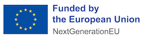

# SAML Identity Provider for BankID

 

-----

## About

Many Swedish public organizations makes use of the [Sweden Connect](https://www.swedenconnect.se) 
SAML-federation in order to offer their users the possibility to login using a Swedish eID. However,
[BankID](https://www.bankid.com), which is the largest eID-provider in Sweden does not offer
 a SAML IdP (Identity Provider). This has lead to that a number of different work-arounds have 
emerged where some organizations have purchased third-party integrations against BankID outside of
the Sweden Connect-federation, others have implemented their own BankID-solutions and some
have even managed to buy or build BankID IdP:s from third party vendors and joined Sweden Connect.

The aim with the [SAML Identity Provider for BankID](https://github.com/swedenconnect/bankid-saml-idp)
open source initiative is to offer organizations a SAML IdP that is implemented according to
the [Swedish eID Framework](https://docs.swedenconnect.se/technical-framework/) and may be 
used within the [Sweden Connect Federation](https://www.swedenconnect.se).

An organization wishing to use the open source BankID-IdP basically takes the following steps:

- Make frontend changes to get an UI look and feel of the service that corresponds with the
organization's requirements.

- Possibly make some back-end changes regarding specific issues (for example to have supervision
or audit logging according to the organization's requirements).

- Deploy the IdP-service within the organization's domain.

- Publish SAML metadata to Sweden Connect (or other federation).

See below for instructions on how to build your own BankID SAML IdP application.

<a name="documentation">
## Documentation

- [Release notes](https://docs.swedenconnect.se/bankid-saml-idp/release-notes.html)

- [BankID and Sweden Connect Resources](https://docs.swedenconnect.se/bankid-saml-idp/bankid-sc-resources.html)
  - Links to relevant information about how to sign BankID contracts and how to find technical information published by BankID and Sweden Connect.
  
- [Downloading BankID IdP Artifacts](artifacts.html)

- [Development Guidelines for the SAML IdP for BankID](https://docs.swedenconnect.se/bankid-saml-idp/development.html)

  - Also see the [Contributing to the BankID SAML IdP](https://github.com/swedenconnect/bankid-saml-idp/blob/main/CONTRIBUTING.md) document.
  
- [Web Browser and Device Support](browsers.html)
  
- [Configuration of the BankID SAML IdP](https://docs.swedenconnect.se/bankid-saml-idp/configuration.html)

- Code Documentation

  - [Generated Javadoc](https://docs.swedenconnect.se/bankid-saml-idp/apidocs)
  
  - [BankID Back-end API](https://docs.swedenconnect.se/bankid-saml-idp/idp-api.html)

- [Making Overrides and Customizations to the Application](https://docs.swedenconnect.se/bankid-saml-idp/override.html)

- [Events and Audit Logging](https://docs.swedenconnect.se/bankid-saml-idp/logging.html)

- [Monitoring the Application](https://docs.swedenconnect.se/bankid-saml-idp/monitoring.html)

- [Samples](https://github.com/swedenconnect/bankid-saml-idp/tree/main/samples)

  - [How to Externalize the Frontend into a Separate Application](https://github.com/swedenconnect/bankid-saml-idp/tree/main/samples/external-frontend)

  - [How to Apply Overrides to the UI](https://github.com/swedenconnect/bankid-saml-idp/tree/main/samples/dynamic-overrides)
  
  - [How the BankID IdP is Deployed in Sweden Connect Sandbox](https://github.com/swedenconnect/bankid-saml-idp/tree/main/samples/sandbox)

- [Adding Your BankID IdP to Sweden Connect](join-sweden-connect.html)

-----

Copyright &copy; 2023-2025, [Myndigheten för digital förvaltning - Swedish Agency for Digital Government (DIGG)](http://www.digg.se). Licensed under version 2.0 of the [Apache License](http://www.apache.org/licenses/LICENSE-2.0).

