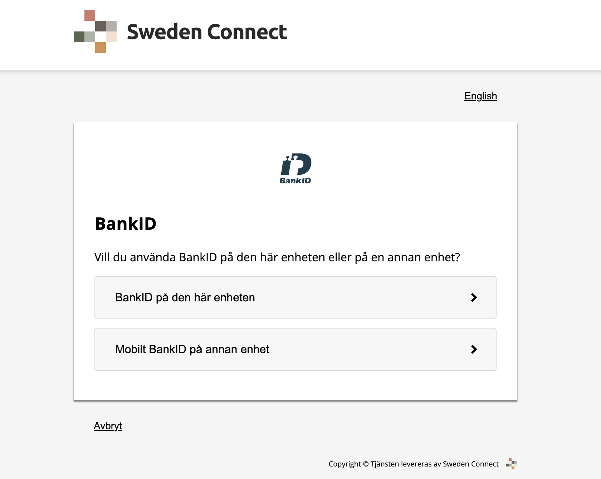
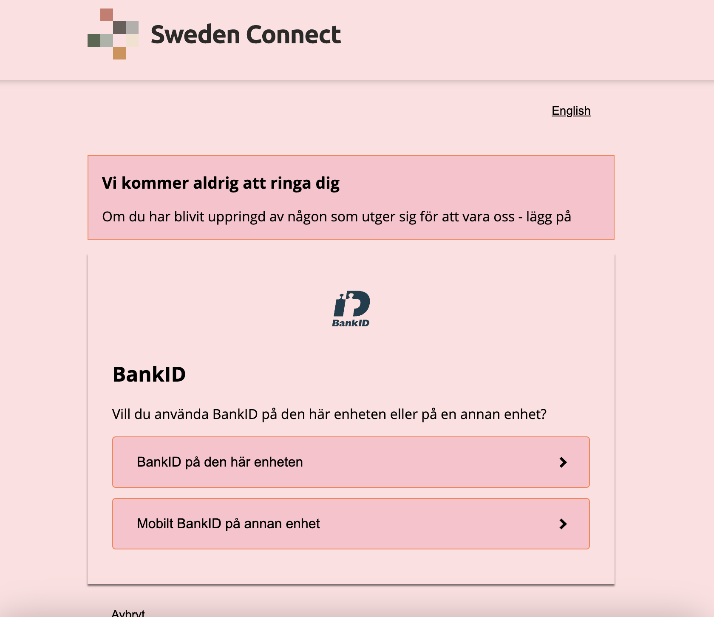

# Sample: Applying UI Overrides in Runtime

[](https://opensource.org/licenses/Apache-2.0)

---

One option to customize the look of your BankID IdP application is to use "overrides", as descibed in [Customizing the BankID IdP UI](https://docs.swedenconnect.se/bankid-saml-idp/override.html#customizing-the-bankid-idp-ui).

This comes with the benefit of not having to write your own frontend and not having to rebuild the application.

## Docker + Overload + Environment Variable

For this example we will build the application using the following script.
```shell
sh build-backend.sh
```

Then we will use an example deployment specified under the folder `services/`

We use a property named `BANKID_UI_OVERRIDE_DIRECTORY_PATH` to allow overrides to be configured
at runtime (startup).

Please see [Customizing the BankID IdP UI](https://docs.swedenconnect.se/bankid-saml-idp/override.html#customizing-the-bankid-idp-ui) for more information regarding overrides.

To make the overrides available for our Docker container we use a volume mount of our overrides.

### Example

We will run the application twice, first without overrides and secondly with overrides.
With the example overrides, we will make the whole page pink and define a new message that will be 
displayed on the main page.

#### Without Overrides
```yml
      #- BANKID_UI_OVERRIDE_DIRECTORY_PATH=/opt/overrides #Disabled
```


#### With Overrides
```yml
      - BANKID_UI_OVERRIDE_DIRECTORY_PATH=/opt/overrides #Enabled
```


---

Copyright &copy; 2023, [Myndigheten för digital förvaltning - Swedish Agency for Digital Government (DIGG)](http://www.digg.se). Licensed under version 2.0 of the [Apache License](http://www.apache.org/licenses/LICENSE-2.0).