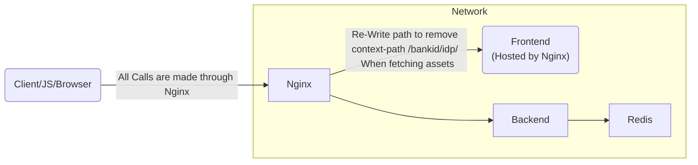

# Sample: Externalizing the Frontend

[](https://opensource.org/licenses/Apache-2.0)

---

If you want to configure your BankID IdP application to host the frontend externally (not inside 
the backend pod/instance) this example will provide a minimal working example of this architecture. 

This example will _NOT_ cover all details. 

## Architecture


## Running the Example

To run the example, execute the following commands inside the directory `samples/external-frontend`

```shell
build-frontend.sh
build-backend.sh
docker compose up
```

## Noteworthy Configuration for Externalized Frontend

### Environment Overrides for Backend

```
- SPRING_REDIS_HOST=redisstack                        # Point to your hostname (specified in docker compose)
- SPRING_REDIS_SSL_EXT_ENABLE_HOSTNAME_VERIFICATION=false   # Disable hostname verification (if needed)
- SERVER_SSL_KEYSTORE=/opt/bankid-idp/ssl.jks         # Override the builtin ssl certificate with the one speicifeid in the example
- SERVER_PORT=8445                                    # Change Port
- SERVER_FORWARDHEADERSSTRATEGY=native                # Enable Spring Boot to read ForwardHeaders
- BANKID_BUILT_IN_FRONTEND=false                      # Disable the built-in frontend
- BANKID_AUTHN_AUTHN_PATH=/                           # Change path to redirect the user back to / when SAML AuthnRequest has been handled
```
### Routing for Nginx

See the [Nginx Configuration](./nginx.conf).

Be careful when configuring forwarding so that the correct URL (port included) is correct. This is
required for the validation of SAML requests.

### Common Configuration Issues

This is not an extensive list of issues that can be misconfigured, but provides some guidance for 
common pitfalls during configuration.

#### Invalid Nginx X-Forwarding

If forwarding to the backend is misconfigured you might see an issue similar to the below. 

> 2030-01-01 00:00:00.000 ERROR 1 --- [nio-8445-exec-4] .c.b.s.i.ReceivedEndpointSecurityHandler : Message Handler:  SAML message intended destination endpoint 'https://local.dev.swedenconnect.se:8443/bankid/idp/saml2/redirect/authn' did not match the recipient endpoint 'https://local.dev.swedenconnect.se:8445/bankid/idp/saml2/redirect/authn'

Notice that the slight difference in the destination endpoint will fail the request.

#### Invalid Nginx Path Rewrite

Since the BankID IdP application uses a context-path that the frontend assumes still exists for assets,
we need to rewrite the path when fetching assets from nginx rather than the application.

---

Copyright &copy; 2023, [Myndigheten för digital förvaltning - Swedish Agency for Digital Government (DIGG)](http://www.digg.se). Licensed under version 2.0 of the [Apache License](http://www.apache.org/licenses/LICENSE-2.0).
