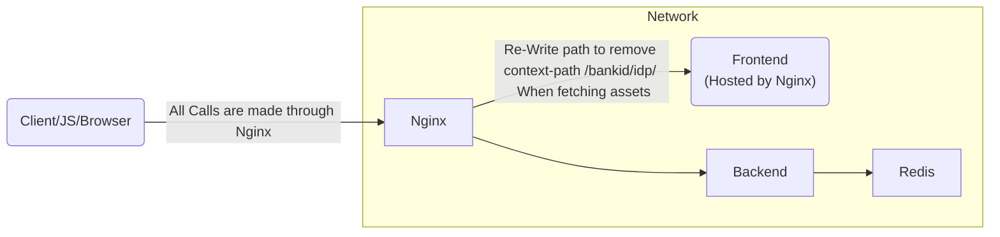

# Working example of externalized frontend

If you want to configure your BankID-IDP Application to host frontend externally (not inside the backend pod)
This example will provide a minimal working example of this architecture. 

This example will _NOT_ cover all details. 

## Architecture


## Running the example
To run the example please execute the following commands inside the directory `samples/external-frontend`

```shell
build-frontend.sh
build-backend.sh
docker compose up
```
## Noteworthy configuration for externalized frontend

### Environment-Overrides for Backend
```
  - SPRING_REDIS_HOST=redisstack                        # Point to your hostname (specified in docker compose)
  - SPRING_REDIS_TLS_ENABLEHOSTNAMEVERIFICATION=false   # Disable hostname verification (if needed)
  - SERVER_SSL_KEYSTORE=/opt/bankid-idp/ssl.jks         # Override the builtin ssl certificate with the one speicifeid in the example
  - SERVER_PORT=8445                                    # Change Port
  - SERVER_FORWARDHEADERSSTRATEGY=native                # Enable Spring Boot to read ForwardHeaders
  - BANKID_BUILTINFRONTEND_DISABLE=true                 # Disable the built-in frontend
  - BANKID_AUTHN_AUTHNPATH=/                            # Change AuthNPath to redirect the user back to / when AuthNRequest has been handled
```
### Routing for Nginx
Please see the [Nginx Configuration](./nginx.conf)

Be careful when configuring forwarding so that the correct url (port included) is correct

This is required for the validation of SAML requests

### Common Misconfiguration Issues

This is not an extensive list of all things that can be misconfigured but provides some common pitfalls for configuration

#### Invalid Nginx X-Forwarding
If forwarding to the backend is misconfigured you might see an issue similar to this one. Notice the slight difference in the destination endpoint will fail the request.
> 2030-01-01 00:00:00.000 ERROR 1 --- [nio-8445-exec-4] .c.b.s.i.ReceivedEndpointSecurityHandler : Message Handler:  SAML message intended destination endpoint 'https://local.dev.swedenconnect.se:8443/bankid/idp/saml2/redirect/authn' did not match the recipient endpoint 'https://local.dev.swedenconnect.se:8445/bankid/idp/saml2/redirect/authn'

#### Invalid Nginx Path Rewrite
Since the BankID-IDP Application uses a context-path that the frontend assumes still exists for assets, we need to rewrite the path when fetching assets from nginx rather than the application otherwise an issue similar to this will occur.
